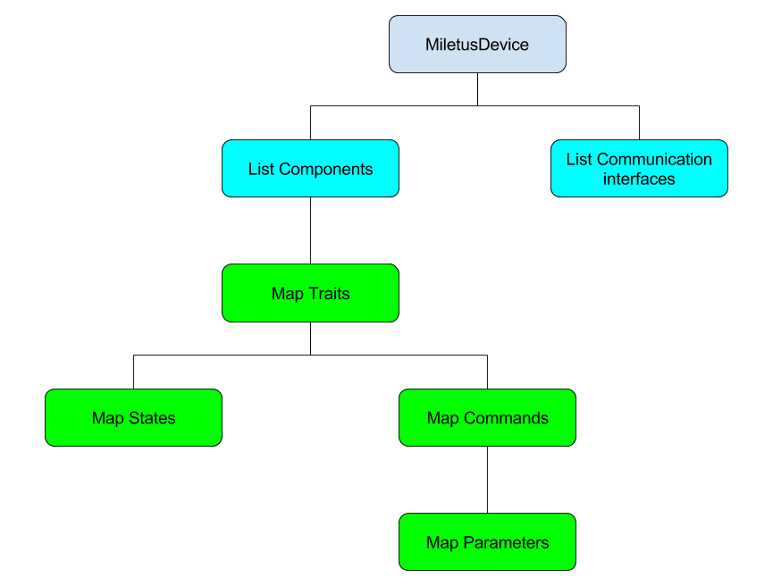

# LibMiletus
Welcome to libMiletus repository!

## Architecture overview
Every device that runs the library holds a instance of MiletusDevice.

Traits are loaded from a JSON description.
The user has to load a provider instance to the libmiletus instance.
The user also loads one or more instances of communication interfaces.
A list containing the name of traits is used to "load" a new component.



## Concepts
#### Components
Components are abstractions to hold a set of one or more Traits.
#### Traits
A Trait describes specific characteristics from modules of device.
##### Commands
Commands are hold by Traits, exposing procedures that can be invoked.
This commands can have arguments, that is passed as a Parameter.
###### Parameters
Each parameter has a name and a set of properties like type, range.
##### States
Each Trait can describe a set of one or more States.
The State is described in the Tait JSON.
This description contains the type of the value and can include the range of possible values.
Components exposes the current value of a State. 

#### Example
Exemplifying an air conditioning system that contains a display.
For this device we have the components:
- control
- environment
- display

The control Component holds the Trait onOff, and temperature.
The environment Component has temperature and humidity as Traits.
The display Component has Traits for brilightness, contrast, and also has the Trait onOff

For example the Trait temperature of the Component control has Commands to increase, decrease, and set a specific temperature. The State of this Trait exposes the current set temperature.

An abstract example of the device is represented in JSON format bellow.

```javascript
{
  "Device": {
    "AirConditioning": {
      "components": {
        "Control": {
          "traits": {
            "onOff": {
              "commands": {
                "onOff": {}
              },
              "states": {
                "isTurnedOn": {
                  "type": "boolean",
                  "currentValue": true
                }
              }
            },
            "temperature": {
              "commands": {
                "setTemperature": {
                  "parameters": {
                    "temperature": {
                      "type": "number",
                      "maximum": 30,
                      "minimum": 17
                    }
                  }
                },
                "increaseTemperature": {},
                "decreaseTemperature": {}
              },
              "states": {
                "temperature": {
                  "unity": "ceucius",
                  "type": "number",
                  "maximum": 30,
                  "minimum": 17,
                  "currentValue": 23
                }
              }
            }
          }
        },
        "Environment": {
          "traits": {
            "temperature": {
              "states": {
                "temperature": {
                  "unity": "ceucius",
                  "type": "number",
                  "maximum": 30,
                  "minimum": 17,
                  "currentValue": 23
                }
              }
            },
            "humidity": {
              "states": {
                "humidity": {
                  "unity": "percentage",
                  "type": "number",
                  "maximum": 100,
                  "minimum": 0,
                  "currentValue": 58
                }
              }
            },
            "lightness": {
              "state": {
                "lightness": {
                  "unity": "lux",
                  "type": "number",
                  "maximum": 20000,
                  "minimum": 0.0001,
                  "currentValue": 348.57
                }
              }
            }
          }
        },
        "Display": {
          "traits": {
            "onOff": {
              "commands": {
                "onOff": {}
              },
              "states": {
                "isTurnedOn": {
                  "type": "boolean",
                  "currentValue": true
                }
              }
            },
            "brilightness": {
              "commands": {
                "setBrilightness": {
                  "parameters": {
                    "brilightness": {
                      "type": "number",
                      "maximum": 100,
                      "minimum": 0
                    }
                  }
                }
              },
              "states": {
                "brilightness": {
                  "unity": "percentage",
                  "type": "number",
                  "maximum": 100,
                  "minimum": 0,
                  "currentValue": 50
                }
              }
            },
            "contrast": {
              "commands": {
                "setContrast": {
                  "parameters": {
                    "brilightness": {
                      "type": "number",
                      "maximum": 100,
                      "minimum": 0
                    }
                  }
                }
              },
              "states": {
                "contrast": {
                  "unity": "percentage",
                  "type": "number",
                  "maximum": 100,
                  "minimum": 0,
                  "currentValue": 50
                }
              }
            }
          }
        }
      }
    }
  }
}
```

## Requests
All information from the device is retrieved as from requests.
### mDNS
### Info
An overview information about the device connection capabilities is retrieved by the request info.

In Linux/Unix you can use the command curl in the IP of the device to retrieve these information.
```bash
curl 192.168.0.11/info
```
The response comes in the JSON format.
An example is shown below.
```javascript
{
  "AccountId": "",
  "Id": "1c9c1b5d",
  "Name": "Example_Device",
  "Description": "",
  "ModelManifestId": "LIBMI",
  "UiDeviceKind": "vendor",
  "Location": "",
  "LocalId": "",
  "DiscoveryTransport": {
    "hasCloud": false,
    "hasWifi": false,
    "hasLan": true,
    "hasBle": false,
    "LanTransport": {
      "ConnectionStatus": "online",
      "HttpAddress": "192.168.0.11",
      "HttpInfoPort": 8080,
      "HttpPort": 8081,
      "HttpUpdatesPort": 8082,
      "HttpsPort": 8083,
      "HttpsUpdatesPort": 8084
    },
    "CloudTransport": {
      "ConnectionStatus": "",
      "Id": ""
    },
    "WifiTransport": {
      "ConnectionStatus": "",
      "Ssid": ""
    },
    "BleTransport": {
      "ConnectionStatus": "",
      "Address": ""
    }
  }
}
```

### Traits
All of the description of device capabilities is exposed by traits.
The traits can be retrieved in the same form as was described in the device.
Using this information you can know information about the device states, retrieved in a [component](#components-1) request or [execute a command](#command-execution).

```bash
curl 192.168.0.11/traits
```
```javascript
{
  "fingerprint": 135246,
  "traits": {
    "room": {
      "commands": {
        "onOff": {
          "parameters": {
            "lightparam": {
              "type": "boolean"
            }
          }
        }
      },
      "state": {
        "light": {
          "isRequired": true,
          "type": "boolean"
        },
        "temperature": {
          "isRequired": true,
          "type": "number"
        },
        "humidity": {
          "isRequired": true,
          "type": "number"
        }
      }
    }
  }
}
```

#### Components

```bash
curl 192.168.0.11/components
```
```javascript
{
  "fingerprint": 135246,
  "components": {
    "RoomA": {
      "traits": [
        "room"
      ],
      "state": {
        "room": {
          "light": true,
          "temperature": 25,
          "humidity": 33
        }
      }
    }
  }
}

```
#### Command Execution
```bash
curl -H "Content-Type: application/json" -X POST -d '{"name":"room.onOff","component":"RoomA","parameters":{"lightparam":true}}' 192.168.0.11/commands/execute
```

##### Response success
```javascript
{
  "state": "done",
  "results": {
    "actualBrilightness": 48
  }
}
```

##### Response fail
```javascript
{
  "state": "error",
  "error": {
    "code": "invalidBrilightness"
  }
}
```

### BLE package encapsulation

## Instalation

### Requirements
 - [ArduinoJson](https://github.com/bblanchon/ArduinoJson) library.

### Intalation

```sh
cd ~/Arduino/libraries/
git clone THIS
```

#### ESP8266 dependences
- [Arduino core for ESP8266](https://github.com/esp8266/Arduino).

### Todos

 - Write Tests
 - Implement command responses
 - Check for possible memory leaks
 - Implements other communication drivers
 - Command in progress
 - Check received values
 - Check value in range in setState
 - Make device ID persistent
 - Make Current states persistent
 - Figure out how to propagate state changes (xmpp?)


## License
MIT

## Porting to another platform

List of current supported platforms

 - ESP8266 (Arduino IDE)
 

To port to another platform you need to implement the abstract classes from

 * libMiletusProvider.h
  --- To provide basic platform features required from libMiletus 
     * Get a random number 
     * Print debug messages
     * Show memory usage


 - libMiletusComIf.h
   --- To provide communication capabilities (WiFi, BLE, Etc.)
   - Act as a server, handing requests
   - Send encapsulated messages to the client 
   - Configure auto-discovery mechanism (mDNS, GAT, Etc.)
   

